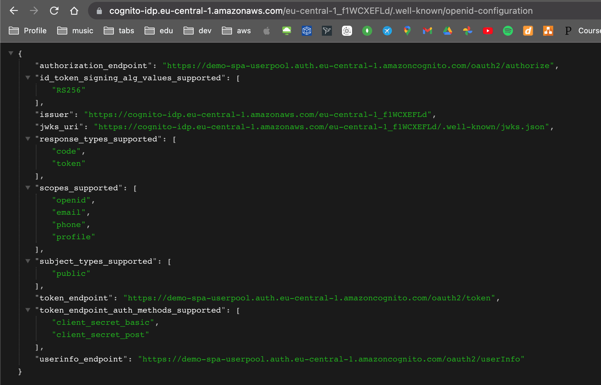

## Cognito user pool
- Create manually
- https://docs.aws.amazon.com/cognito/latest/developerguide/cognito-user-pools-app-integration.html
- https://www.youtube.com/watch?v=WgvVxKf2CFc

### View hosted UI (Login & Signup)
User Pool > App Integrations > select app client > View Hosted UI

### Congnito OpenID Endpoints
```
https://cognito-idp.{region}.amazonaws.com/{userPoolId}/.well-known/openid-configuration
```
```
Example:
https://cognito-idp.eu-central-1.amazonaws.com/eu-central-1_f1WCXEFLd/.well-known/openid-configuration
```



-demouser
-Q123456q.

## OAuth in App
